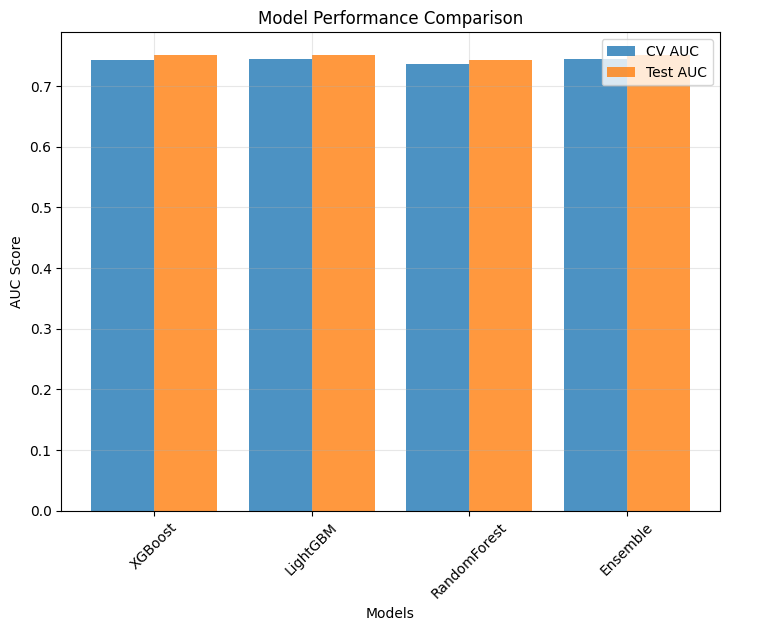
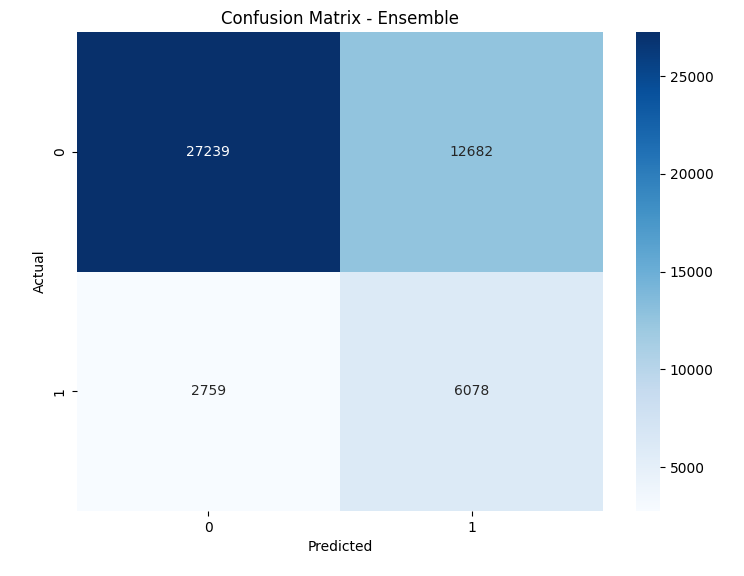
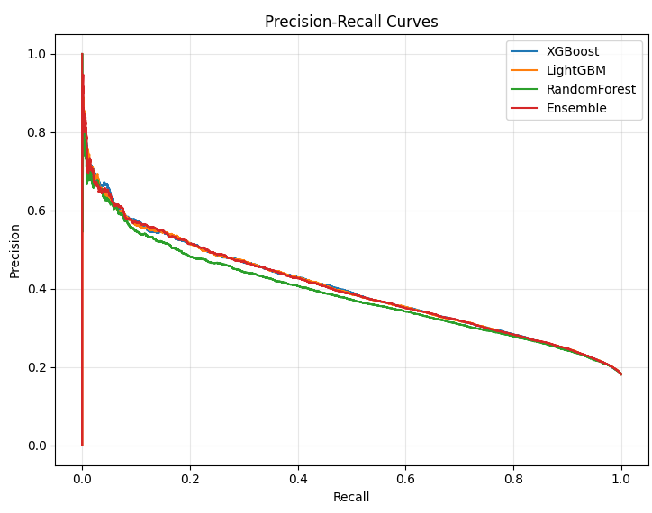

<h1 align="center" id="title">Customer Churn Prediction Using an Ensemble Learning Approach</h1>

This project focuses on predicting customer churn for a subscription-based service. By leveraging a dataset with various customer attributes, this analysis involves a comprehensive exploratory data analysis (EDA), robust data preprocessing, and the development of multiple machine learning models. The final solution employs a soft-voting ensemble model combining the strengths of XGBoost, LightGBM, and RandomForest to achieve the highest predictive performance.

## 📈 Project Highlights
- **Comprehensive EDA**: In-depth analysis of numerical and categorical features to uncover patterns, detect outliers, and understand correlations with churn.
- **Feature Engineering**: Implemented systematic preprocessing steps including ordinal and one-hot encoding for categorical variables and standardization for numerical features.
- **Class Imbalance Handling**: Addressed the imbalanced nature of the churn data using techniques like `scale_pos_weight` for XGBoost and `class_weight='balanced'` for other models.
- **Advanced Modeling**: Trained and evaluated three powerful gradient boosting and tree-based models: XGBoost, LightGBM, and RandomForest.
- **Ensemble Method**: Developed a soft-voting `VotingClassifier` that aggregates predictions from the individual models to improve accuracy and robustness.
- **Rigorous Evaluation**: Utilized 5-fold stratified cross-validation for model validation and evaluated final models on a hold-out test set using AUC-ROC, Precision, Recall, and F1-Score.

---
## ⚙️ Methodology

The project follows a structured workflow from data exploration to final model deployment.

### 1. Exploratory Data Analysis (EDA)
The initial phase involved a deep dive into the training data to understand its characteristics.
- **Data Inspection**: The dataset was loaded and checked for missing values and data types . `CustomerID` was identified as an irrelevant feature and dropped.
- **Numerical Feature Analysis**:
    - Descriptive statistics were generated to summarize central tendencies and dispersion.
    - Boxplots were used to visualize distributions and identify outliers. These outliers were subsequently handled using the Interquartile Range (IQR) method .
    - A correlation matrix heatmap revealed a high correlation between `TotalCharges` and `MonthlyCharges`, leading to the removal of `MonthlyCharges` to avoid multicollinearity.
- **Categorical Feature Analysis**:
    - The distribution of each categorical feature was visualized using count plots and pie charts.
    - Analysis showed that most features were uniformly distributed across their categories, with a comparable balance between male and female customer data.

### 2. Data Preprocessing & Feature Engineering
Before modeling, the data was cleaned and transformed into a suitable format.
- **Categorical Encoding**:
    - **Ordinal Mapping**: `SubscriptionType` was mapped to numerical values (`Basic`: 0, `Standard`: 1, `Premium`: 2).
    - **Binary Mapping**: Features with 'Yes'/'No' values were converted to 1/0.
    - **One-Hot Encoding**: Nominal features like `PaymentMethod`, `ContentType`, and `Gender` were converted into numerical format using one-hot encoding.
- **Numerical Scaling**: All numerical features were scaled using `StandardScaler` to ensure they have a mean of 0 and a standard deviation of 1.

### 3. Model Building & Training
The preprocessed data was split into training (80%) and testing (20%) sets, with stratification to maintain the same proportion of churned users in both sets.
- **Individual Models**:
    - **XGBoost**: An `XGBClassifier` was configured with `scale_pos_weight` set to 4.52 to handle class imbalance.
    - **LightGBM**: An `LGBMClassifier` was used with the `class_weight='balanced'` parameter.
    - **Random Forest**: A `RandomForestClassifier` was also set up with `class_weight='balanced'`.
- **Ensemble Model**:
    - A `VotingClassifier` was created to combine the three individual models.
    - It was configured with `voting='soft'`, allowing it to average the predicted probabilities from each model.

### 4. Evaluation and Results
All models were rigorously evaluated using 5-fold stratified cross-validation and tested on the hold-out set.
- **Performance Comparison**: The models were compared based on their mean Cross-Validation AUC and final Test AUC scores. The ensemble model emerged as the top performer.

| Model | CV_AUC_Mean | CV_AUC_Std | Test_AUC |
| :--- | :--- | :--- | :--- |
| **Ensemble** | **0.7439** | **0.0031** | **0.7509** |
| LightGBM | 0.7439 | 0.0030 | 0.7507 |
| XGBoost | 0.7435 | 0.0029 | 0.7508 |
| RandomForest | 0.7355 | 0.0035 | 0.7424 |

The chart below visually compares the Cross-Validation AUC and Test AUC for each model, confirming the strong and consistent performance of the Ensemble model.

The final ensemble model's performance was further analyzed using a confusion matrix and precision-recall curves to understand its classification accuracy and the trade-offs between precision and recall.

<table>
  <tr>
    <td></td>
    <td></td>
  </tr>
</table>

Finally, a feature importance plot from the XGBoost model highlighted `AccountAge` and `TotalCharges` as key influential features in predicting churn.

- **Final Model Analysis**:
    - The **Ensemble model** achieved a **Test AUC of 0.7509**.
    - The confusion matrix for the ensemble model shows its performance in classifying true positives and true negatives.
    - The feature importance plot from the XGBoost model highlighted key influential features in predicting churn.

---
## 🎯 Conclusion
The ensemble model proved to be the most effective, demonstrating that combining multiple models can lead to superior predictive power. The model predicted a **churn rate of 37.60%** on new, unseen data, indicating a significant potential for customer loss and highlighting the business need for proactive retention strategies.

This project serves as a comprehensive case study on handling a real-world churn prediction problem, from initial data exploration to final model comparison and interpretation.

---
## 💻 Technologies Used
- **Python**
- **Pandas & NumPy**: For data manipulation and numerical operations.
- **Scikit-learn**: For data preprocessing, modeling, and evaluation.
- **XGBoost & LightGBM**: For implementing gradient boosting models.
- **Matplotlib & Seaborn**: For data visualization.
